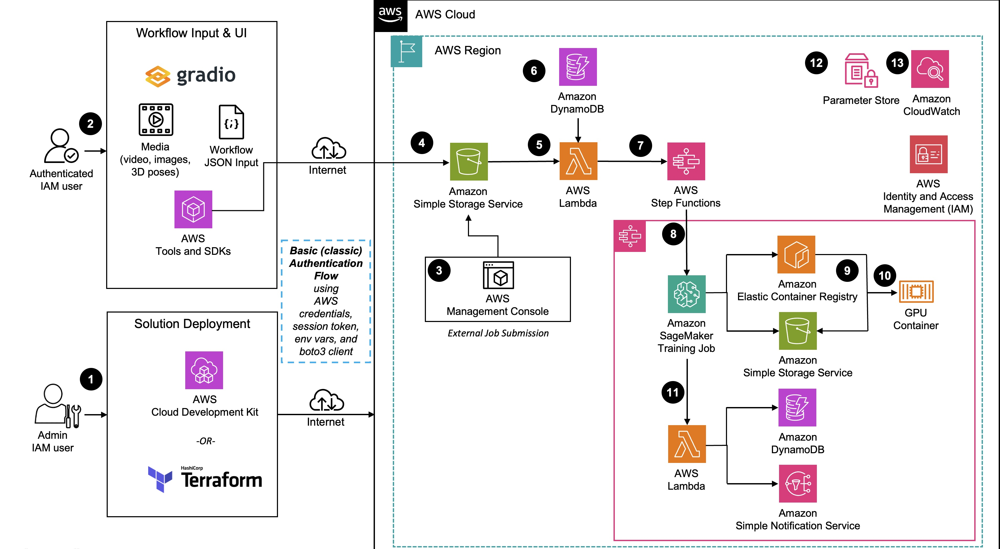

# Guidance for Open Source 3D Reconstruction Toolbox for Gaussian Splats on AWS

## Table of Contents

1. [Overview](#overview)
2. [Architecture](#architecture)
3. [Prerequisites](#prerequisites)
4. [Deployment and User Guide](#deployment-and-user-guide)
5. [Cost](#cost)
6. [Next Steps](#next-steps)
7. [Authors](#authors)

## Overview

The Open Source 3D Reconstruction Toolbox for Gaussian Splats provides an end-to-end, pipeline-based guidance on AWS to reconstruct 3D scenes or objects from images or video inputs. The infrastructure can be deployed via AWS Cloud Development Kit (CDK) or Terraform leveraging infrastructure-as-code.

Once deployed, the guidance features a full 3D reconstruction back-end system with the following customizable components or pipelines:

1. **Media Ingestion**: Process videos or collections of images as input
2. **Image Processing**: Automatic filtering, enhancement, and preparation of source imagery (e.g. background removal)
3. **Structure from Motion (SfM)**: Camera pose estimation and initial 3D point cloud generation
4. **Gaussian Splat Training**: Optimization of 3D Gaussian primitives to represent the scene using AI/ML
5. **Export & Delivery**: Generation of the final 3D asset in standard formats for easy viewing and notification via email

By deploying this guidance, users gain access to a flexible infrastructure that handles the entire 3D reconstruction process programatically, from media upload to final 3D model delivery, while being highly modular through its componentized pipeline-based approach. This guidance addresses the significant challenges organizations face when trying to create photorealistic 3D content - traditionally a time-consuming, expensive, and technically complex process requiring specialized skills and equipment.

## Architecture

This guidance will:

- create the infrastructure required to create a gaussian splat from a video or set of images
- create the mechanism to run the code and perform 3D reconstruction
- enable a user to create a 3D gaussian splat from the backend (no UI) using open source tools and AWS by uploading a video (.mp4 or .mov) or images (.png or .jpg) and metadata (.json) into S3

### Architecture Diagram

<!--  -->

 
 
<i>Figure 1: 3D Reconstruction Toolbox for Gaussian Splats on AWS Reference Architecture  </i>

### Architecture Steps

1. System administrator deploys guidance to AWS account and region using AWS Cloud Development Kit or Terraform.
2. Once guidance is deployed in a specific AWS account and region, an authenticated user uploads the necessary configuration and input media into a dedicated Amazon Simple Storage Service (S3) bucket location. This can be done using a Gradio interface and AWS Software Development Kit (SDK).
3. Optionally, the guidance supports external job submission by uploading a ‘.json’ job configuration file and media into a designated S3 bucket location. This upload process could be manual through the AWS Management Console or could also be an external process depending on the use-case.
4. The job json file upload to the bucket location will trigger an Amazon Simple Notification Service (SNS) message that will invoke an initialization AWS Lambda function.
5. The initialization Lambda function will perform input validation and set appropriate variables for the state machine.
6. The workflow job record will be created in Amazon DynamoDB job table.
7. The initialization Lambda function will invoke an AWS Step Functions State Machine to handle the entire workflow job.
8. If the configuration is successful, an Amazon SageMaker Training Job will be submitted synchronously using the state machine built-in wait until completion mechanism. Otherwise (jump to step 11), the completion Lambda function will handle the error, update the database and notify the user via an SNS email.
9. The Amazon Elastic Container Registry (ECR) container image and S3 model artifacts will be used to spin up a new graphics processing unit (GPU) container. The instance type is determined by the job json configuration.
10. The GPU container will run the entire pipeline.
11. Upon job completion or error, a completion Lambda function will complete the workflow job by updating the job in DynamoDB and notifying the user via email upon completion using SNS.
12. Internal workflow parameters are stored in Parameter Store during guidance deployment to decouple services.
13. Amazon CloudWatch is used to monitor the training logs, surfacing errors to the user.

### AWS Services in this Guidance

**TO DO: Update list of services to the actually used in the guidance**

| **AWS Service**                                                          | Role |                                                               |
| ------------------------------------------------------------------------ | ---- | ------------------------------------------------------------- |
| [Amazon Transcribe](https://aws.amazon.com/transcribe/)                  | Core | Convert user speech to text.                                  |
| [Amazon Bedrock](https://aws.amazon.com/bedrock/)                        | Core | Invoke foundation model to translate natural language to ASL. |
| [Amazon API Gateway](https://aws.amazon.com/api-gateway/)                | Core | Create API to invoke lambda functions from user interface.    |
| [AWS Lambda](https://aws.amazon.com/lambda/)                             | Core | Run custom code to generate ASL for simplified text.          |
| [Amazon Cognito](https://aws.amazon.com/pm/cognito/)                     | Core | Authenticate user to access ASL translator                    |
| [Amazon Comprehend](https://aws.amazon.com/comprehend/)                  | Core | Run moderation to detect toxicity on generated text           |
| [Amazon Rekognition](https://aws.amazon.com/rekognition/)                | Core | Run moderation to detect toxicity on generated image          |
| [Amazon CloudFront](https://aws.amazon.com/cloudfront/)                  | Core | Fast and secure web-hosted user experience                    |
| [Amazon Simple Storage Service (S3)](https://aws.amazon.com/pm/serv-s3/) | Core | Host user interface code, store generated images              |
| [Amazon Simple Notification Service (SNS)](https://aws.amazon.com/sns/)  | Core | Send the notification to Unreal Engine                        |
| [Amazon Simple Queue Service (SQS)](https://aws.amazon.com/sqs/)         | Core | Queue notifications for Unreal Engine to consume              |

### Custom GS Pipeline Container

In this project, there is only one Docker container that contains all of the 3D reconstruction tools for Gaussian Splatting. This container has a `Dockerfile`, `main.py`, and helper script files and open source libraries under the `backend/container` directory. The main script processes each request from the SageMaker Training Job invoke message and saves the result to S3 upon successful completion. The list of open source libraries that make this project possible include:

- [NerfStudio](https://github.com/nerfstudio-project/nerfstudio) [(Apache-2.0)](https://github.com/nerfstudio-project/nerfstudio/tree/main?tab=Apache-2.0-1-ov-file#readme)
- [Glomap](https://github.com/colmap/glomap) [(BSD-3-Clause)](https://github.com/colmap/glomap?tab=BSD-3-Clause-1-ov-file#readme)
- [Colmap](https://github.com/colmap/colmap) [(BSD)](https://github.com/colmap/colmap?tab=License-1-ov-file#readme)
- [OpenCV](https://github.com/opencv/opencv) [(Apache-2.0)](https://github.com/opencv/opencv?tab=Apache-2.0-1-ov-file#readme)
- [gsplat](https://github.com/nerfstudio-project/gsplat) [(Apache-2.0)](https://github.com/nerfstudio-project/gsplat?tab=Apache-2.0-1-ov-file#readme)
- [backgroundremover](https://github.com/nadermx/backgroundremover) [(MIT)](https://github.com/nadermx/backgroundremover?tab=MIT-1-ov-file#readme)
- [splatfacto-w](https://github.com/KevinXu02/splatfacto-w) [(Apache-2.0)](https://github.com/KevinXu02/splatfacto-w?tab=Apache-2.0-1-ov-file#readme)

## Prerequisites

### Third-party tools

- Docker

### AWS account requirements

An active AWS Account with IAM user or role with elevated permissions to deploy resources is required to deploy this guidance, along with either a local computer with appropriate AWS credentials to deploy the CDK or Terraform solution, or utilize an AWS EC2 workstation to build and deploy the CDK or Terraform solution. Instructions for doing this will be in the [Implementation Guide](https://implementationguides.kits.eventoutfitters.aws.dev/open-3drt-0403/compute/open-source-3d-reconstruction-toolbox-for-gaussian-splats-on-aws.html)

Resources included in this deployment:

- EC2
- VPC
- IAM roles with permissions
- CloudFormation
- ECR
- S3
- SageMakerTraining Jobs
- Stepfunctions
- CDK (bootstrap instructions will be included in the [Implementation Guide](https://implementationguides.kits.eventoutfitters.aws.dev/open-3drt-0403/compute/open-source-3d-reconstruction-toolbox-for-gaussian-splats-on-aws.html))

### Service limits

- [Service quotas](https://docs.aws.amazon.com/servicequotas/latest/userguide/intro.html) - increases can be requested via the AWS Management Console, AWS CLI, or AWS SDKs (see [Accessing Service Quotas](https://docs.aws.amazon.com/servicequotas/latest/userguide/intro.html#access))

- (Optional) SageMaker Training Jobs uses a Docker container to run the training. This deployment guide has a `Deploy backend container` section that walks through building a custom container image for SageMaker. You can optionally build and test this container locally (not running on SageMaker) on a GPU-enabled EC2 instance. If you plan to do this, increase the EC2 quota named "Running On-Demand G and VT instances" and/or "Running On-Demand P instances", depending on the instance family you plan to use, to a desired maximum number of vCPUs for running instances of the target family. Note, this is vCPUs NOT number of instances like the SageMaker Batch Transform quota.

- Install and configure the AWS CLI (if not using the recommended EC2 deployment below)

  - [Install or update the latest version of the AWS CLI](https://docs.aws.amazon.com/cli/latest/userguide/getting-started-install.html)

  - [Set up the AWS CLI](https://docs.aws.amazon.com/cli/latest/userguide/getting-started-quickstart.html) - create configuration and set up credentials

- Install [Git](https://git-scm.com/) (if not using the recommended EC2 deployment below)

- [Docker](https://docs.docker.com/get-docker/) installed (if not using the recommended EC2 deployment below)
  - N.B. [`buildx`](https://github.com/docker/buildx) is also required. For Windows and macOS `buildx` [is included](https://github.com/docker/buildx#windows-and-macos) in [Docker Desktop](https://docs.docker.com/desktop/)
  - Docker is required to build the container image that is used for training the splat. This will require at least 20GB of empty disk space on your deployment machine.
    > _Note: If building on Windows or MacOS and receive the below error, set the number of logical processors to 1. Also, it is recommended to use the EC2 Ubuntu deployment method below to mitigate this error._

## Cost

This section is for a high-level cost estimate. Think of a likely straightforward scenario with reasonable assumptions based on the problem the Guidance is trying to solve. Provide an in-depth cost breakdown table in this section below ( you should use AWS Pricing Calculator to generate cost breakdown ).

Start this section with the following boilerplate text:

_You are responsible for the cost of the AWS services used while running this Guidance. As of <month> <year>, the cost for running this Guidance with the default settings in the <Default AWS Region (Most likely will be US East (N. Virginia)) > is approximately $<n.nn> per month for processing ( <nnnnn> records )._

Replace this amount with the approximate cost for running your Guidance in the default Region. This estimate should be per month and for processing/serving resonable number of requests/entities.

Suggest you keep this boilerplate text:
_We recommend creating a [Budget](https://docs.aws.amazon.com/cost-management/latest/userguide/budgets-managing-costs.html) through [AWS Cost Explorer](https://aws.amazon.com/aws-cost-management/aws-cost-explorer/) to help manage costs. Prices are subject to change. For full details, refer to the pricing webpage for each AWS service used in this Guidance._

### Cost Table

**Note : Once you have created a sample cost table using AWS Pricing Calculator, copy the cost breakdown to below table and upload a PDF of the cost estimation on BuilderSpace. Do not add the link to the pricing calculator in the ReadMe.**

The following table provides a sample cost breakdown for deploying this Guidance with the default parameters in the US East (N. Virginia) Region for one month.

| AWS Service        | Dimensions                                                                       | Cost [USD]        |
| ------------------ | -------------------------------------------------------------------------------- | ----------------- |
| Amazon S3          | Standard feature storage (input=200MB, output=2.5GB)                             | $1.61/month       |
| Amazon S3          | Data transfer feature                                                            | $0.90/month       |
| Amazon DynamoDB    | Job table storage, 0.5MB per month, 1GB total, avg item size=825bytes            | $0.81/month       |
| AWS Lambda         | 2 invocations per job, 1.25s, 7.1s = 8.5s                                        | $0.01/month       |
| AWS Step Functions | State transitions per workflow = 5                                               | $0.01/month       |
| Amazon SageMaker   | num_instance=1, num_hours_per_job=1, ml.g5.4xlarge, Volume_size_in_GB_per_job=15 | $273.00/month     |
| Amazon ECR         | Data storage, 15GB                                                               | $1.47/month       |
| Amazon SNS         | Email notifications, 1 per request                                               | $0.01/month       |
| Parameter Store    | Store 1 param                                                                    | $0.01/month       |
| Amazon CloudWatch  | Metrics, 1GB                                                                     | $0.50/month       |
| **TOTAL**          | (est. 100 requests)                                                              | **$278.33/month** |

## Deployment and User Guide

**TO DO: update with Live link when published**
For detailed guidance deployment steps and running the guidance as a user please see the [Implementation Guide](https://implementationguides.kits.eventoutfitters.aws.dev/open-3drt-0403/compute/open-source-3d-reconstruction-toolbox-for-gaussian-splats-on-aws.html)

## Next Steps

This robust framework for 3D reconstruction serves as a fundamental building block for scalable construction of 3D environments and content workflows. You can extend this solution in multiple ways: embed it into your web applications, integrate it with game engines for interactive experiences, or implement it in virtual production environments - these are just a few possibilities to support your requirements.

By leveraging other AWS services, you can further enhance your workflow to scale, share, and optimize your 3D reconstruction needs, whatever they might be.

## Authors

- Eric Cornwell, Sr. Spatial Compute SA
- Dario Macangano, Sr. Worldwide Visual Compute SA
- Stanford Lee, Technical Account Manager
- Daniel Zilberman, Sr. SA AWS Technical Guidances
