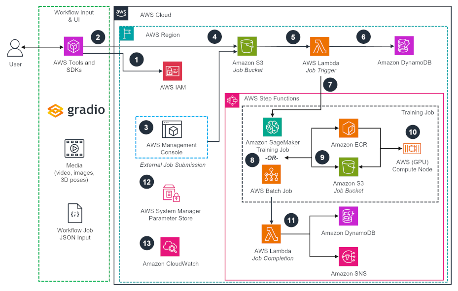

# Guidance for Open Source 3D Reconstruction Toolbox for Gaussian Splats on AWS

## Table of Contents

1. [Overview](#overview)
2. [Architecture](#architecture)
3. [Prerequisites](#prerequisites)
4. [Cost](#cost)
5. [Security](#security)
6. [Deployment and User Guide](#deployment-and-user-guide)
7. [Next Steps](#next-steps)
8. [License](#license)
9. [Authors](#authors)

## Overview

The Open Source 3D Reconstruction Toolbox for [Gaussian Splats](https://huggingface.co/blog/gaussian-splatting) provides an end-to-end, pipeline-based AWS prescriptive guidance to reconstruct 3D scenes or objects from images or video inputs. The infrastructure can be deployed via AWS Cloud Development Kit (CDK) or Terraform leveraging infrastructure-as-code.

Once deployed, the guidance features a full 3D reconstruction back-end system with the following customizable components or pipelines:

1. **Media Ingestion**: Process videos or collections of images as input
2. **Image Processing**: Automatic filtering, enhancement, and preparation of source imagery (e.g. background removal)
3. **Structure from Motion (SfM)**: Camera pose estimation and initial 3D point cloud generation
4. **Gaussian Splat Training**: Optimization of 3D Gaussian primitives to represent the scene using AI/ML
5. **Export & Delivery**: Generation of the final 3D asset in standard formats for easy viewing and notification via email

By deploying this guidance, users gain access to a flexible infrastructure that handles the entire 3D reconstruction process programmatically, from media upload to final 3D model delivery, while being highly modular through its componentized pipeline-based approach. This guidance addresses the significant challenges organizations face when trying to create photorealistic 3D content - traditionally a time-consuming, expensive, and technically complex process requiring specialized skills and equipment.

## Architecture

This guidance will:

- create the infrastructure required to create a Gaussian splat from a video or set of images
- create the mechanism to run the code and perform 3D reconstruction
- enable a user to create a 3D Gaussian splat using open source tools and AWS by uploading a video (.mp4 or .mov) or images (.png or .jpg) and metadata (.json) into S3
- provide a 3D viewer for viewing the photo-realistic effects and performant nature of Gaussian splats

### Architecture Diagram

 
 
<i>Figure 1: 3D Reconstruction Toolbox for Gaussian Splats on AWS Reference Architecture</i>

### Architecture Steps
1. User authenticates to [AWS Identity and Access Management (IAM)](https://aws.amazon.com/iam/) via AWS Tools and SDKs.
2. The input is uploaded to a dedicated [Amazon Simple Storage Service (S3)](https://aws.amazon.com/s3/)  job bucket location. This can be done using a Gradio interface and AWS Software Development Kit (SDK).
3. Optionally, the guidance supports external job submission by uploading a ‘.JSON’ job configuration file and media into a designated S3 job bucket location. 
4. The job JSON file uploaded to the S3 job bucket will trigger an [Amazon Simple Notification Service (SNS)](https://aws.amazon.com/sns/) message that will invoke an initialization [AWS Lambda](https://aws.amazon.com/lambda/) function.
5. The job trigger **AWS Lambda** function will perform input validation and set appropriate variables for the [AWS Step Function State Machine](https://aws.amazon.com/step-functions/).
6. The workflow job record will be created in [Amazon DynamoDB](https://aws.amazon.com/dynamodb/) job table.
7. The job trigger **AWS Lambda** function will invoke an **AWS Step Functions State Machine** to handle the entire workflow job.
8. An [Amazon SageMaker](https://aws.amazon.com/sagemaker/) Training or [AWS Batch](https://aws.amazon.com/batch/) Job will be submitted synchronously using the state machine built-in wait until completion mechanism. 
9. The [Amazon Elastic Container Registry (ECR)](https://aws.amazon.com/ecr/) container image and S3 job bucket model artifacts will be used to spin up a new Graphics Processing Unit (GPU) container. The compute node instance type is determined by the job JSON configuration.
10. The GPU container will run the entire pipeline as an **Amazon SageMaker** training or **AWS Batch** job.
11. The job completion **AWS Lambda** function will complete the workflow job by updating the job metadata in **Amazon DynamoDB** and notifying the user via email upon completion using **Amazon SNS**.
12. Internal workflow parameters are stored in [AWS System Manager Parameter Store](https://docs.aws.amazon.com/systems-manager/latest/userguide/systems-manager-parameter-store.html) during guidance deployment to decouple the job trigger **AWS Lambda** function and the **AWS Step Function State Machine**.
13. [Amazon CloudWatch](https://aws.amazon.com/cloudwatch/) is used to monitor the training logs, surfacing errors to the user.

### AWS Services in this Guidance

| **AWS Service**                                                                    | Role |                                                                                                  |
| -----------------------------------------------------------------------------------| ---- | -------------------------------------------------------------------------------------------------|
| [Amazon Simple Storage Service (S3)](https://aws.amazon.com/pm/serv-s3/)           | Core | Host training models, job configurations, media, and generated assets                            |
| [AWS Lambda](https://aws.amazon.com/lambda/)                                       | Core | Run custom code to process requests                                                              |
| [Amazon Simple Notification Service (SNS)](https://aws.amazon.com/sns/)            | Core | Send completion status via notification to email                                                 |
| [AWS Step Functions](https://aws.amazon.com/step-functions/)                       | Core | Orchestrate the 3D reconstruction workflow                                                       |
| [Amazon DynamoDB](https://aws.amazon.com/dynamodb/)                                | Core | Store training job details and attributes                                                        |
| [Amazon SageMaker](https://aws.amazon.com/sagemaker/)                              | Core | Run 3D reconstruction pipeline processing on container using On-Demand instances                                          |
| [AWS Batch](https://aws.amazon.com/batch/)                              | Core | Run 3D reconstruction pipeline processing on container using Spot instances                                          |
| [Amazon Elastic Container Service](https://aws.amazon.com/ecs/)                    | Core | Orchestrate 3D reconstruction pipeline processing on containers                                       |
| [Amazon Elastic Container Registry](https://aws.amazon.com/ecr/)                   | Core | Image store for the custom created container                                                     |
| [Amazon CloudWatch](https://aws.amazon.com/cloudwatch/)                            | Core | Monitor logs and surface errors to SNS                                                           |
| [AWS Identity and Access Management](https://aws.amazon.com/iam/)                  | Core | Security access controls to run the workflow securely                                            |
| [AWS Cloud Development Kit](https://aws.amazon.com/cdk/)                           | Core | Cloud infrastructure as code for easy deployment                                                 |
| [Amazon Systems Manager Parameter Store](https://aws.amazon.com/systems-manager/)  | Core | Securely store infrastructure resource ids in Parameter Store to aid in deployment and execution |

### Custom GS Pipeline Container

In this project, there is only one Docker container that contains all of the 3D reconstruction tools for Gaussian Splatting. This container has a `Dockerfile`, `main.py`, and helper script files and open source libraries under the `source/container` directory. The main script processes each request from the SageMaker or Batch Training Job using ECS invoke message and saves the result to S3 upon successful completion.

For debugging purposes, the container can be deployed locally using [this](source/container/LOCAL_DEBUG_README.md) document.

Current features and open source libraries include:

| Category            | Component                                                    | Software                                     | Can Use GPU?      | Notes                                                                                                        |
| ------------------- | ------------------------------------------------------------ | -------------------------------------------- | -------- | ------------------------------------------------------------------------------------------------------------ |
| Video Processing | Video to Images                                              | [OpenCV](https://github.com/opencv/opencv) [(Apache-2.0)](https://github.com/opencv/opencv?tab=Apache-2.0-1-ov-file#readme) | No | Extract frames (images) from video. Supports .mov/.mp4, perspective/equirectangular. Can set start/stop time. |
| Video Processing | Filter Blurry Images from Video                              | [Sharp Frame Extractor](https://github.com/cansik/sharp-frame-extractor) [(MIT)](https://github.com/cansik/sharp-frame-extractor?tab=MIT-1-ov-file) | No | Remove blurry images from a correlated set of frames in a video.                                      |
| Spherical Images | Equirectangular to Perspective                               | [OpenCV](https://github.com/opencv/opencv) [(Apache-2.0)](https://github.com/opencv/opencv?tab=Apache-2.0-1-ov-file#readme) | No | Convert spherical images into perspective images for processing. Remove cube map faces from the dataset.        |
| Segmentation     | Erase Objects                                                | [rembg](https://github.com/danielgatis/rembg/) [(MIT)](https://github.com/danielgatis/rembg/#MIT-1-ov-file), [Attentive-Eraser](https://github.com/Anonym0u3/AttentiveEraser) [(Apache-2.0)](https://github.com/Anonym0u3/AttentiveEraser#Apache-2.0-1-ov-file) | Yes | Use u2net to classify objects and erase them using diffusion/in-painting. Supports "human".                  |
| Segmentation     | Remove Objects                                               | [rembg](https://github.com/danielgatis/rembg/) [(MIT)](https://github.com/danielgatis/rembg/#MIT-1-ov-file) | Yes | Use u2net to classify objects and remove/mask them. Supports "human".                                        |
| Segmentation     | Remove Background                                            | [backgroundremover](https://github.com/nadermx/backgroundremover) [(MIT)](https://github.com/nadermx/backgroundremover?tab=MIT-1-ov-file#readme), [sam2](https://github.com/facebookresearch/sam2) [(Apache-2.0/BSD-3-Clause)](https://github.com/facebookresearch/sam2/blob/main/LICENSE) | Yes |Use u2net or SAM2 to detect objects (rigid body) and remove background. SAM2 only supports video.            |
| Reconstruction   | Images to Point Cloud/Poses - Incremental SfM                | [Colmap](https://github.com/colmap/colmap) [(BSD)](https://github.com/colmap/colmap?tab=License-1-ov-file#readme) | Yes |Supports Colmap. input video/images only or images + pose-priors.                                            |
| Reconstruction   | Images to Point Cloud/Poses - Global SfM                     | [Glomap](https://github.com/colmap/glomap) [(BSD-3-Clause)](https://github.com/colmap/glomap?tab=BSD-3-Clause-1-ov-file#readme) | Yes |Supports Glomap. input video/images only or images + pose-priors.                                            |
| Reconstruction   | Images to Point Cloud/Poses - Hierarchical SfM               | [HLOC](https://github.com/cvg/Hierarchical-Localization) [(Apache-2.0)](https://github.com/cvg/Hierarchical-Localization?tab=Apache-2.0-1-ov-file#readme) | Yes |Supports Hloc. input video/images only or images + pose-priors.                                            |
| Reconstruction   | Images to Point Cloud/Poses - Transformer                     | [MapAnything](https://github.com/facebookresearch/map-anything) [(Apache-2.0)](https://github.com/facebookresearch/map-anything#Apache-2.0-1-ov-file) | Yes | Supports MapAnything with GPU (limited to < 50 images)                                                 |
| Training         | Images, Point Cloud, & Poses to Gaussian Splat               | [NerfStudio](https://github.com/nerfstudio-project/nerfstudio) [(Apache-2.0)](https://github.com/nerfstudio-project/nerfstudio/tree/main?tab=Apache-2.0-1-ov-file#readme), [gsplat](https://github.com/nerfstudio-project/gsplat) [(Apache-2.0)](https://github.com/nerfstudio-project/gsplat?tab=Apache-2.0-1-ov-file#readme), [splatfacto-w](https://github.com/KevinXu02/splatfacto-w) [(Apache-2.0)](https://github.com/KevinXu02/splatfacto-w?tab=Apache-2.0-1-ov-file#readme), [3DGRUT](https://github.com/nv-tlabs/3dgrut) [(Apache-2.0)](https://github.com/nv-tlabs/3dgrut#Apache-2.0-1-ov-file) | Yes | Supports splatfacto, splatfacto-big, splatfacto-mcmc, splatfacto-w-light, 3dgrt, 3dgut, nerfacto              |
| Training         | 3D Image Signal Processing - Bilateral Grid, PPISP              | [PPISP](https://github.com/nv-tlabs/ppisp) [(Apache-2.0)](https://github.com/nv-tlabs/ppisp?tab=Apache-2.0-1-ov-file), [Bilateral Grid](https://github.com/yuehaowang/bilarf) [(Apache-2.0)](https://github.com/yuehaowang/bilarf?tab=Apache-2.0-1-ov-file) | Yes | Supports Bilateral Grid and PPISP            |
| Post Processing  | Export Gaussian Splat and Metadata                           | [Splat-Transform](https://github.com/playcanvas/splat-transform) [(MIT)](https://github.com/playcanvas/splat-transform#MIT-1-ov-file), [spz](https://github.com/nianticlabs/spz/tree/main) [(MIT)](https://github.com/nianticlabs/spz/tree/main#MIT-1-ov-file) | Yes | Supports outputs .ply, .spz, .sog, .usdz (beta), .mp4(splat render), .jpg(thumbnail), metrics(psnr, lpips, ssim)                                                                               |
| Post Processing  | Transform/Rotate all generated objects from native to viewer | [Splat-Transform](https://github.com/playcanvas/splat-transform) [(MIT)](https://github.com/playcanvas/splat-transform#MIT-1-ov-file) | Yes | Supports Gradio interface coordinate system             |
| Post Processing  | Crop all generated objects                                   | | Yes | Supports environments or rigid_objects to reduce noise.             |
| User Interface   | Submit jobs, view results                                    | [Gradio](https://github.com/gradio-app/gradio) [(Apache-2.0)](https://github.com/gradio-app/gradio#Apache-2.0-1-ov-file) | No |
| Web Viewer       | View 3D objects                        | [SuperSplat](https://github.com/playcanvas/supersplat) [(MIT)](https://github.com/playcanvas/supersplat?tab=MIT-1-ov-file#readme), [Babylon.js](https://github.com/BabylonJS/Babylon.js) [(Apache-2.0)](https://github.com/BabylonJS/Babylon.js#Apache-2.0-1-ov-file) | Yes |

>*Note: A Gaussian splat job can be submitted either through a [user interface](source/Gradio/Readme.md) or [back-end](source/readme.md) depending on your preference. Full deployment details can be found in the [Implementation Guide](https://aws-solutions-library-samples.github.io/compute/open-source-3d-reconstruction-toolbox-for-gaussian-splats-on-aws.html).*

## Prerequisites

### Third-party tools

- [Git CLI](https://cli.github.com/)
- [Docker](https://www.docker.com/) 
- [Terraform](https://developer.hashicorp.com/terraform/tutorials/aws-get-started/install-cli) if choosing not to deploy infrastructure using [AWS CDK](https://aws.amazon.com/cdk/) 

### AWS account requirements

An active AWS Account with IAM user or role with elevated permissions to deploy resources is required to deploy this guidance, along with either a local computer with appropriate AWS credentials to deploy the CDK or Terraform guidance, or utilize an AWS EC2 instance to build and deploy the CDK or Terraform guidance. Please refer to the [Implementation Guide](https://aws-solutions-library-samples.github.io/compute/open-source-3d-reconstruction-toolbox-for-gaussian-splats-on-aws.html) for detailed instructions for deployment and running the guidance.

- EC2 (if choosing not to deploy infrastructure from your local computer)
- IAM roles with permissions
- CloudFormation
- ECR Image
- S3 Buckets
- DynamoDB Table
- Lambda Functions
- SageMaker Training Jobs
- Batch Jobs
- Step Functions State Machine
- AWS CDK (Please refer to the [Implementation Guide](https://aws-solutions-library-samples.github.io/compute/open-source-3d-reconstruction-toolbox-for-gaussian-splats-on-aws.html) for detailed instructions for deployment and running the guidance.)

### Service limits

- [Service quotas](https://docs.aws.amazon.com/servicequotas/latest/userguide/intro.html) - increases can be requested via the AWS Management Console, AWS CLI, or AWS SDKs (see [Accessing Service Quotas](https://docs.aws.amazon.com/servicequotas/latest/userguide/intro.html#access))

- This guidance runs SageMaker Training Jobs or Batch Jobs which uses a Docker container to run the training. This deployment guide walks through building a custom container image for SageMaker or Batch.
  - Depending on what instances you will be using to train on (configured during job submission, ml.g5.4xlarge is the default), you may need to adjust the SageMaker Training Jobs or Batch Jobs quota. This will be under the SageMaker service in Service Quotas named "training job usage" or AWS Batch Job "instance usage".
  - (Optional) You can optionally build and test this container locally (not running on AWS Services) on a GPU-enabled EC2 instance. If you plan to do this, increase the EC2 quota named "Running On-Demand G and VT instances" and/or "Running On-Demand P instances", depending on the instance family you plan to use, to a desired maximum number of vCPUs for running instances of the target family. Note, this is vCPUs NOT number of instances like the SageMaker Training Jobs quota.

## Cost

_You are responsible for the cost of the AWS services used while running this Guidance. As of May 2025, the cost for running this Guidance with the default settings in the default AWS Region (US East 1(N. Virginia)) is approximately $73.33 per month for processing 100 requests._

_We recommend creating a [Budget](https://docs.aws.amazon.com/cost-management/latest/userguide/budgets-managing-costs.html) through [AWS Cost Explorer](https://aws.amazon.com/aws-cost-management/aws-cost-explorer/) to help manage costs. Prices are subject to change. For full details, refer to the pricing webpage for each AWS service used in this Guidance._

### Cost Table

The following table provides a sample cost breakdown for deploying this Guidance with the default parameters in the US East (N. Virginia) Region for one month.

**Spot Instance (Batch/ECS)**
| AWS Service        | Dimensions                                                                       | Cost [USD]        |
| ------------------ | -------------------------------------------------------------------------------- | ----------------- |
| Amazon S3          | Standard feature storage (input=200MB, output=2.5GB)                             | $1.61/month       |
| Amazon S3          | Data transfer feature                                                            | $0.90/month       |
| Amazon DynamoDB    | Job table storage, 0.5MB per month, 1GB total, avg item size=825bytes            | $0.81/month       |
| AWS Lambda         | 2 invocations per job, 1.25s, 7.1s = 8.5s                                        | $0.01/month       |
| AWS Step Functions | State transitions per workflow = 5                                               | $0.01/month       |
| Amazon ECR         | Data storage, 15GB                                                               | $1.47/month       |
| Amazon SNS         | Email notifications, 1 per request                                               | $0.01/month       |
| Parameter Store    | Store 1 param                                                                    | $0.01/month       |
| Amazon CloudWatch  | Metrics, 1GB                                                                     | $0.50/month       |
| AWS CodeBuild      | Optional, $0.005 per minute, 100min free, only need build once, takes ~60mn      | -                 |
| Amazon ECS/Batch   | num_instance=1, num_hours_per_job=1, ml.g5.4xlarge, Volume_size_in_GB_per_job=15 | $68.00/month      |
| **TOTAL**          | (est. 100 requests)                                                              | **$73.33/month**  |

> *Note: Amazon SageMaker can be used instead of AWS Batch for on-demand processing, bypassing any wait queues for ~$142.33/month total*

## Security

When you build systems on AWS infrastructure, security responsibilities are shared between you and AWS. This [shared responsibility
model](https://aws.amazon.com/compliance/shared-responsibility-model/) reduces your operational burden because AWS operates, manages, and
controls the components including the host operating system, the virtualization layer, and the physical security of the facilities in
which the services operate. For more information about AWS security, visit [AWS Cloud Security](http://aws.amazon.com/security/).

- All data is encrypted at rest and at transit within the AWS Cloud services in this Guidance
- An Amazon S3 access logging bucket logs all access to the asset bucket
- Input validation on the job configuration will flag any misconfigurations in the json file
- Least priviledge access rights on service actions

**Considerations**

At the time of publishing (Mar 2026), the codebase was scanned using [Semgrep](https://semgrep.dev/), [Bandit](https://github.com/PyCQA/bandit), [Checkov](https://www.checkov.io/), [Gitleaks](https://github.com/gitleaks/gitleaks), [Grype](https://github.com/anchore/grype), and [Codeguru](https://aws.amazon.com/codeguru/) code security scanning tools. The following table outlines all security issues flagged as ERROR or CRITICAL with explanations. All critical and error issues have been reviewed and mitigated or confirmed as false positives as documented below.
| Level   | Classification  | Source       | Rule ID                             | Cause                                                                                                  | Explanation                                                                                                                                                              |
| ------- | --------------- | ------------ | ----------------------------------- | ------------------------------------------------------------------------------------------------------ | ------------------------------------------------------------------------------------------------------------------------------------------------------------------------ |
| Error   | False Positive  | Semgrep      | arbitrary-sleep — main.py, check_build_status.py | `time.sleep()` call detected; may indicate unintentional blocking | The `time.sleep()` calls in `main.py` are intentional polling delays used to wait for GPU memory cleanup and SageMaker/Batch job status transitions. The calls in `check_build_status.py` are intentional polling loops that wait for CodeBuild job completion. These are required operational patterns, not accidental blocking code. |
| Error   | False Positive  | Semgrep      | useless-inner-function — generate_splat_gradio.py:3052 | Function `open_viewer_from_files_modal` is defined inside a function but never used | This inner function is defined as a Gradio event handler callback and is registered with a Gradio component's `.click()` event. Semgrep does not trace Gradio's dynamic event registration pattern and incorrectly reports it as unused. The function is actively invoked at runtime by the Gradio framework. |
| Error   | False Positive  | Semgrep      | dangerous-subprocess-use-audit / dangerous-subprocess-use-tainted-env-args — convert_ply_to_sog.py:68,79 | subprocess 'run' without static string or with user-controlled data | All arguments to `subprocess.run()` in `convert_ply_to_sog.py` are constructed from `argparse`-parsed values validated at the CLI boundary. The command is passed as a list (no `shell=True`), preventing shell injection. The input/output paths originate from the job configuration validated in `main.py`. |
| Error   | False Positive  | Semgrep      | dangerous-subprocess-use-audit / dangerous-subprocess-use-tainted-env-args — coordinate_systems.py:58 | subprocess 'run' without static string or with user-controlled data | The `splat-transform` command in `coordinate_systems.py` is built from a fixed list of hardcoded arguments plus `argparse`-validated input/output paths. No `shell=True` is used. The rotation value is looked up from a hardcoded `TRANSFORMS` dictionary keyed by a validated `--target` argument, not from raw user input. |
| Error   | False Positive  | Semgrep      | dangerous-subprocess-use-audit / dangerous-subprocess-use-tainted-env-args — crop_splat.py:83,95 | subprocess 'run' without static string or with user-controlled data | All `subprocess.run()` calls in `crop_splat.py` invoke `sys.executable` with hardcoded sibling scripts (`extract_center_cube.py`, `refine_center_object.py`) and `cp`/`mv` system utilities. Arguments are constructed from `argparse`-validated paths. No `shell=True` is used and no raw user input is passed directly to the shell. |
| Error   | False Positive  | Semgrep      | dangerous-subprocess-use-audit — rotate_portrait_images.py:54 | subprocess 'run' without static string | The `ffprobe` call in `rotate_portrait_images.py` uses a hardcoded command list with only the video file path appended. The video file path originates from `os.listdir()` on a validated dataset directory, not from direct user input. No `shell=True` is used. |
| Error   | False Positive  | Semgrep      | dangerous-subprocess-use-audit — sharp_video_to_images.py:79 | subprocess 'run' without static string | The `sharp-frame-extractor` call uses a hardcoded command list with `argparse`-validated `video_path`, `num_frames`, and `output` arguments. No `shell=True` is used. All parameters are validated at the CLI entry point before being passed to this function. |
| Error   | False Positive  | Semgrep      | dangerous-subprocess-use-audit — run_map_anything.py:62 | subprocess 'run' without static string | The `python map-anything/scripts/demo_colmap.py` call uses a hardcoded script path and `argparse`-validated `scene_dir`, `skip_point2d`, and `voxel_size` arguments formatted as `--key=value` strings. No `shell=True` is used. The `env` dict is a copy of `os.environ` with only `PYTHONPATH` modified. |
| Error   | False Positive  | Semgrep      | dangerous-subprocess-use-audit — panorama_sfm.py:358 | subprocess 'run' without static string | The `subprocess.run()` calls in `panorama_sfm.py` invoke `sys.executable` with hardcoded module paths (`-m pre_processing.segmentation.*`) and validated directory paths from `argparse`. No `shell=True` is used. All path arguments are derived from the validated `args.output_path` namespace. |
| Error   | False Positive  | Grype        | CVE — github.com/opencontainers/selinux v1.11.1 | Known vulnerability in go-module dependency | This Go module is a transitive dependency of the container build toolchain, not a runtime dependency of the guidance application. The guidance does not execute SELinux operations directly. The vulnerability does not affect the deployed AWS services or the Python-based pipeline container. |
| Error   | False Positive  | Grype        | CVE — github.com/sigstore/fulcio v1.6.4 | Known vulnerability in go-module dependency | This Go module is a transitive dependency of the container signing/verification toolchain. It is not a runtime dependency of the guidance application or the deployed container. The vulnerability does not affect the deployed AWS services. |
| Error   | False Positive  | Grype        | CVE — stdlib go1.24.1 | Known vulnerability in Go standard library | This Go standard library version is used by build toolchain dependencies, not by the guidance application itself. The guidance runs Python-based workloads on AWS managed services. The Go stdlib CVE does not affect the deployed Python pipeline container or any AWS service used by this guidance. |
| Error   | False Positive  | Codeguru     | Path traversal — crop_splat.py:104 | User-controlled input in file paths | All file paths in `crop_splat.py` are constructed from `argparse`-validated `input_path` and `output_path` arguments using `os.path.abspath()` and `os.path.dirname()`. The intermediate temp path uses `tempfile.mkstemp()`. No raw user input is used to construct paths without normalization. |
| Error   | False Positive  | Codeguru     | Path traversal — create_derivative_plys.py:48 | User-controlled input in file paths | All paths in `create_derivative_plys.py` originate from the job configuration validated via `validate_input_media()` and `os.path.realpath()` in `main.py` before any pipeline module is called. Codeguru does not trace the validation through the call chain. |
| Error   | False Positive  | Codeguru     | Path traversal — images_to_video.py:69 | User-controlled input in file paths | All paths in `images_to_video.py` originate from the job configuration validated in `main.py`. The file uses `glob.glob()` on a validated directory path. Codeguru does not trace the upstream validation. |
| Error   | False Positive  | Codeguru     | OS command injection — erase_object_using_mask.py:373 | Untrusted input used in system commands | The subprocess call in `erase_object_using_mask.py` uses `sys.executable` with a hardcoded module path and validated directory arguments. No `shell=True` is used. All path arguments originate from the job configuration validated in `main.py`. |
| Error   | False Positive  | Codeguru     | Path traversal — remove_background.py:60 | User-controlled input in file paths | All paths in `remove_background.py` originate from the job configuration validated in `main.py`. Input/output directories are validated before being passed to this module. Codeguru does not trace the upstream validation. |
| Error   | False Positive  | Codeguru     | Path traversal — remove_background_sam2.py:210 | User-controlled input in file paths | All paths in `remove_background_sam2.py` originate from the job configuration validated in `main.py`. Codeguru does not trace the upstream validation through the call chain. |
| Error   | False Positive  | Codeguru     | Path traversal — simple_video_to_images.py:80 | User-controlled input in file paths | All paths in `simple_video_to_images.py` originate from the job configuration validated in `main.py`. The video path is validated via `validate_input_media()` before being passed to this module. Codeguru does not trace the upstream validation. |
| Error   | False Positive  | Codeguru     | Path traversal — extract_poses_imgs.py:96 | User-controlled input in file paths | All paths in `extract_poses_imgs.py` originate from the job configuration validated in `main.py`. Codeguru does not trace the upstream validation through the call chain. |
| Error   | False Positive  | Codeguru     | Path traversal — update_camera_model.py:45 | User-controlled input in file paths | All paths in `update_camera_model.py` originate from the job configuration validated in `main.py`. Codeguru does not trace the upstream validation through the call chain. |
| Error   | False Positive  | Codeguru     | Path traversal / OS command injection — main.py:2542 | User-controlled input in file paths or system commands | All paths and subprocess arguments in `main.py` are validated via `validate_input_media()`, `os.path.realpath()`, and UUID validation before use. Subprocess calls use argument lists without `shell=True`. Codeguru does not trace the inline validation guards. |
| Error   | False Positive  | Codeguru     | Path traversal — sharp_video_to_images.py:65 | User-controlled input in file paths | The `video_path` and `output_dir` arguments in `sharp_video_to_images.py` are validated at the CLI entry point via `argparse` and originate from the job configuration validated in `main.py`. Codeguru does not trace the upstream validation. |
| Error   | False Positive  | Codeguru     | Path traversal — rotate_portrait_images.py:109 | User-controlled input in file paths | The `image_dir` and `dataset_path` arguments are validated at the CLI entry point and originate from the job configuration validated in `main.py`. The video file path is constructed from `os.listdir()` on the validated dataset directory. Codeguru does not trace the upstream validation. |
| Error   | False Positive  | Codeguru     | Path traversal — run_map_anything.py:108 | User-controlled input in file paths | All paths in `run_map_anything.py` are derived from the `scene_dir` argument validated at the CLI entry point. Internal paths are constructed using `os.path.join()` with the validated base directory. Codeguru does not trace the upstream validation. |

## Deployment and User Guide

For detailed deployment steps and running this guidance, please see the [Implementation Guide](https://aws-solutions-library-samples.github.io/compute/open-source-3d-reconstruction-toolbox-for-gaussian-splats-on-aws.html)

## Next Steps

This robust framework for 3D reconstruction serves as a fundamental building block for scalable construction of 3D environments and content workflows. You can extend this guidance in multiple ways: embed it into your web applications, integrate it with game engines for interactive experiences, or implement it in virtual production environments - these are just a few possibilities to support your requirements.

By leveraging other AWS services, you can further enhance your workflow to scale, share, and optimize your 3D reconstruction needs, whatever they might be.

## License

This library is licensed under the MIT-0 License. See the [LICENSE](./LICENSE) file.

## Authors

- [Eric Cornwell](https://www.linkedin.com/in/eric-cornwell-2249543b/), Sr. Spatial Compute SA
- [Dario Macangano](https://www.linkedin.com/in/dario-macagnano-6b7562b9/), Sr. Worldwide Visual Compute SA
- [Stanford Lee](https://www.linkedin.com/in/stanfordlee/), Technical Account Manager (Spatial Computing TFC)
- [Daniel Zilberman](https://www.linkedin.com/in/danzilberman/), Sr. Specialist SA, Prototyping & Scaling
