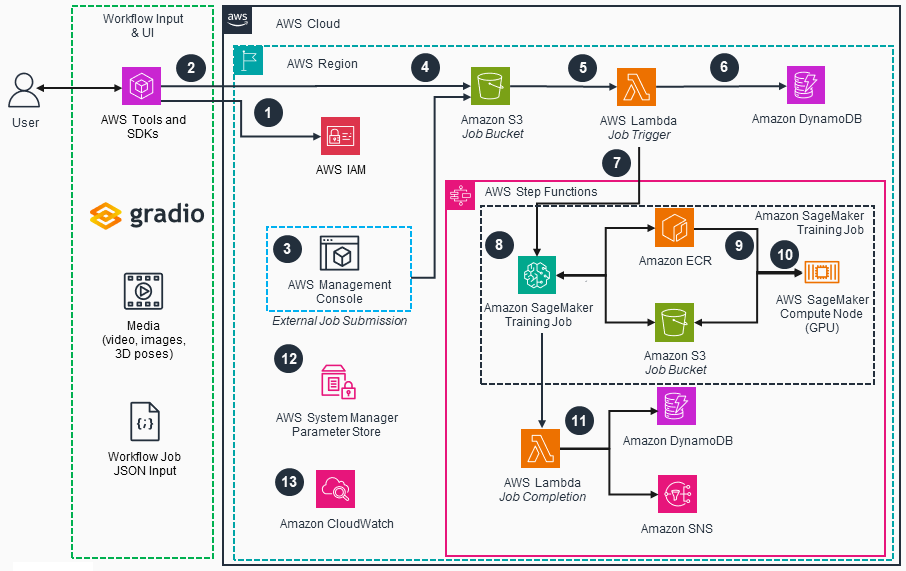

# Guidance for Open Source 3D Reconstruction Toolbox for Gaussian Splats on AWS

## Table of Contents

1. [Overview](#overview)
2. [Architecture](#architecture)
3. [Prerequisites](#prerequisites)
4. [Deployment and User Guide](#deployment-and-user-guide)
5. [Cost](#cost)
6. [Next Steps](#next-steps)
7. [Authors](#authors)

## Overview

The Open Source 3D Reconstruction Toolbox for Gaussian Splats provides an end-to-end, pipeline-based guidance on AWS to reconstruct 3D scenes or objects from images or video inputs. The infrastructure can be deployed via AWS Cloud Development Kit (CDK) or Terraform leveraging infrastructure-as-code.

Once deployed, the guidance features a full 3D reconstruction back-end system with the following customizable components or pipelines:

1. **Media Ingestion**: Process videos or collections of images as input
2. **Image Processing**: Automatic filtering, enhancement, and preparation of source imagery (e.g. background removal)
3. **Structure from Motion (SfM)**: Camera pose estimation and initial 3D point cloud generation
4. **Gaussian Splat Training**: Optimization of 3D Gaussian primitives to represent the scene using AI/ML
5. **Export & Delivery**: Generation of the final 3D asset in standard formats for easy viewing and notification via email

By deploying this guidance, users gain access to a flexible infrastructure that handles the entire 3D reconstruction process programmatically, from media upload to final 3D model delivery, while being highly modular through its componentized pipeline-based approach. This guidance addresses the significant challenges organizations face when trying to create photorealistic 3D content - traditionally a time-consuming, expensive, and technically complex process requiring specialized skills and equipment.

## Architecture

This guidance will:

- create the infrastructure required to create a gaussian splat from a video or set of images
- create the mechanism to run the code and perform 3D reconstruction
- enable a user to create a 3D gaussian splat using open source tools and AWS by uploading a video (.mp4 or .mov) or images (.png or .jpg) and metadata (.json) into S3
- provide a 3D viewer for viewing the photo-realistic effects and performant nature of gaussian splats

### Architecture Diagram

 
 
<i>Figure 1: 3D Reconstruction Toolbox for Gaussian Splats on AWS Reference Architecture</i>

### Architecture Steps
1. User authenticates to [AWS Identity and Access Management (IAM)](https://aws.amazon.com/iam/) via AWS Tools and SDKs.
2. The input is uploaded to a dedicated [Amazon Simple Storage Service (S3)](https://aws.amazon.com/s3/)  job bucket location. This can be done using a Gradio interface and AWS Software Development Kit (SDK).
3. Optionally, the solution supports external job submission by uploading a ‘.JSON’ job configuration file and media into a designated S3 job bucket location. 
4. The job JSON file uploaded to the S3 job bucket will trigger an [Amazon Simple Notification Service (SNS)](https://aws.amazon.com/sns/) message that will invoke an initialization [AWS Lambda](https://aws.amazon.com/lambda/) function.
5. The job trigger **AWS Lambda** function will perform input validation and set appropriate variables for the [AWS Step Function State Machine](https://aws.amazon.com/step-functions/).
6. The workflow job record will be created in [Amazon DynamoDB](https://aws.amazon.com/dynamodb/) job table.
7. The job trigger **AWS Lambda** function will invoke an **AWS Step Functions State Machine** to handle the entire workflow job.
8. An [Amazon SageMaker](https://aws.amazon.com/sagemaker/) Training Job will be submitted synchronously using the state machine built-in wait until completion mechanism. 
9. The [Amazon Elastic Container Registry (ECR)](https://aws.amazon.com/ecr/) container image and S3 job bucket model artifacts will be used to spin up a new Graphics Processing Unit (GPU) container. The compute node instance type is determined by the job JSON configuration.
10. The GPU container will run the entire pipeline as an **Amazon SageMaker** training job.
11. The job completion **AWS Lambda** function will complete the workflow job by updating the job metadata in **Amazon DynamoDB** and notifying the user via email upon completion using **Amazon SNS**.
12. Internal workflow parameters are stored in [AWS System Manager Parameter Store](https://docs.aws.amazon.com/systems-manager/latest/userguide/systems-manager-parameter-store.html) during guidance deployment to decouple the job trigger **AWS Lambda** function and the **AWS Step Function State Machine**.
13. [Amazon CloudWatch](https://aws.amazon.com/cloudwatch/) is used to monitor the training logs, surfacing errors to the user.

### AWS Services in this Guidance

| **AWS Service**                                                                    | Role |                                                                                                  |
| -----------------------------------------------------------------------------------| ---- | -------------------------------------------------------------------------------------------------|
| [Amazon Simple Storage Service (S3)](https://aws.amazon.com/pm/serv-s3/)           | Core | Host training models, job configurations, media, and generated assets                            |
| [AWS Lambda](https://aws.amazon.com/lambda/)                                       | Core | Run custom code to process requests                                                              |
| [Amazon Simple Notification Service (SNS)](https://aws.amazon.com/sns/)            | Core | Send completion status via notification to email                                                 |
| [AWS Step Functions](https://aws.amazon.com/step-functions/)                       | Core | Orchestrate the 3D reconstruction workflow                                                       |
| [Amazon DynamoDB](https://aws.amazon.com/dynamodb/)                                | Core | Store training job details and attributes                                                        |
| [Amazon SageMaker](https://aws.amazon.com/sagemaker/)                              | Core | Run 3D reconstruction pipeline processing on container                                           |
| [Amazon Elastic Container Registry](https://aws.amazon.com/ecr/)                   | Core | Image store for the custom created container                                                     |
| [Amazon CloudWatch](https://aws.amazon.com/cloudwatch/)                            | Core | Monitor logs and surface errors to SNS                                                           |
| [AWS Identity and Access Management](https://aws.amazon.com/iam/)                  | Core | Security access controls to run the workflow securely                                            |
| [AWS Cloud Development Kit](https://aws.amazon.com/cdk/)                           | Core | Cloud infrastructure as code for easy deployment                                                 |
| [Amazon Systems Manager Parameter Store](https://aws.amazon.com/systems-manager/)  | Core | Securely store infrastructure resource ids in Parameter Store to aid in deployment and execution |

### Custom GS Pipeline Container

In this project, there is only one Docker container that contains all of the 3D reconstruction tools for Gaussian Splatting. This container has a `Dockerfile`, `main.py`, and helper script files and open source libraries under the `source/container` directory. The main script processes each request from the SageMaker Training Job invoke message and saves the result to S3 upon successful completion. The list of open source libraries that make this project possible include:

- [NerfStudio](https://github.com/nerfstudio-project/nerfstudio) [(Apache-2.0)](https://github.com/nerfstudio-project/nerfstudio/tree/main?tab=Apache-2.0-1-ov-file#readme)
- [Glomap](https://github.com/colmap/glomap) [(BSD-3-Clause)](https://github.com/colmap/glomap?tab=BSD-3-Clause-1-ov-file#readme)
- [Colmap](https://github.com/colmap/colmap) [(BSD)](https://github.com/colmap/colmap?tab=License-1-ov-file#readme)
- [OpenCV](https://github.com/opencv/opencv) [(Apache-2.0)](https://github.com/opencv/opencv?tab=Apache-2.0-1-ov-file#readme)
- [gsplat](https://github.com/nerfstudio-project/gsplat) [(Apache-2.0)](https://github.com/nerfstudio-project/gsplat?tab=Apache-2.0-1-ov-file#readme)
- [backgroundremover](https://github.com/nadermx/backgroundremover) [(MIT)](https://github.com/nadermx/backgroundremover?tab=MIT-1-ov-file#readme)
- [splatfacto-w](https://github.com/KevinXu02/splatfacto-w) [(Apache-2.0)](https://github.com/KevinXu02/splatfacto-w?tab=Apache-2.0-1-ov-file#readme)
- [sam2](https://github.com/facebookresearch/sam2) [(Apache-2.0/BSD-3-Clause)](https://github.com/facebookresearch/sam2/blob/main/LICENSE)
- [3DGRUT](https://github.com/nv-tlabs/3dgrut) [(Apache-2.0)](https://github.com/nv-tlabs/3dgrut#Apache-2.0-1-ov-file)

## Prerequisites

### Third-party tools

- Git
- Docker
- Terraform (if choosing not to deploy infrastructure using CDK)

### AWS account requirements

An active AWS Account with IAM user or role with elevated permissions to deploy resources is required to deploy this guidance, along with either a local computer with appropriate AWS credentials to deploy the CDK or Terraform solution, or utilize an AWS EC2 workstation to build and deploy the CDK or Terraform solution. Please refer to the [Implementation Guide](https://implementationguides.kits.eventoutfitters.aws.dev/open-3drt-0403/compute/open-source-3d-reconstruction-toolbox-for-gaussian-splats-on-aws.html) for detailed instructions for deployment and running the guidance.

- EC2 (if choosing not to deploy infrastructure from your local computer)
- IAM roles with permissions
- CloudFormation
- ECR Image
- S3 Buckets
- DynamoDB Table
- Lambda Functions
- SageMaker Training Jobs
- Step Functions State Machine
- CDK (Please refer to the [Implementation Guide](https://implementationguides.kits.eventoutfitters.aws.dev/open-3drt-0403/compute/open-source-3d-reconstruction-toolbox-for-gaussian-splats-on-aws.html) for detailed instructions for deployment and running the guidance.)

### Service limits

- [Service quotas](https://docs.aws.amazon.com/servicequotas/latest/userguide/intro.html) - increases can be requested via the AWS Management Console, AWS CLI, or AWS SDKs (see [Accessing Service Quotas](https://docs.aws.amazon.com/servicequotas/latest/userguide/intro.html#access))

- This solution runs SageMaker Training Jobs which uses a Docker container to run the training. This deployment guide walks through building a custom container image for SageMaker.
  - Depending on what instances you will be using to train on (configured during job submission, ml.g5.4xlarge is the default), you may need to adjust the SageMaker Training Jobs quota. This will be under the SageMaker service in Service Quotas named "training job usage".
  - (Optional) You can optionally build and test this container locally (not running on SageMaker) on a GPU-enabled EC2 instance. If you plan to do this, increase the EC2 quota named "Running On-Demand G and VT instances" and/or "Running On-Demand P instances", depending on the instance family you plan to use, to a desired maximum number of vCPUs for running instances of the target family. Note, this is vCPUs NOT number of instances like the SageMaker Training Jobs quota.

## Cost

_You are responsible for the cost of the AWS services used while running this Guidance. As of May 2025, the cost for running this Guidance with the default settings in the default AWS Region (US East 1(N. Virginia)) is approximately $278.33 per month for processing 100 requests._

_We recommend creating a [Budget](https://docs.aws.amazon.com/cost-management/latest/userguide/budgets-managing-costs.html) through [AWS Cost Explorer](https://aws.amazon.com/aws-cost-management/aws-cost-explorer/) to help manage costs. Prices are subject to change. For full details, refer to the pricing webpage for each AWS service used in this Guidance._

### Cost Table

The following table provides a sample cost breakdown for deploying this Guidance with the default parameters in the US East (N. Virginia) Region for one month.

| AWS Service        | Dimensions                                                                       | Cost [USD]        |
| ------------------ | -------------------------------------------------------------------------------- | ----------------- |
| Amazon S3          | Standard feature storage (input=200MB, output=2.5GB)                             | $1.61/month       |
| Amazon S3          | Data transfer feature                                                            | $0.90/month       |
| Amazon DynamoDB    | Job table storage, 0.5MB per month, 1GB total, avg item size=825bytes            | $0.81/month       |
| AWS Lambda         | 2 invocations per job, 1.25s, 7.1s = 8.5s                                        | $0.01/month       |
| AWS Step Functions | State transitions per workflow = 5                                               | $0.01/month       |
| Amazon SageMaker   | num_instance=1, num_hours_per_job=1, ml.g5.4xlarge, Volume_size_in_GB_per_job=15 | $273.00/month     |
| Amazon ECR         | Data storage, 15GB                                                               | $1.47/month       |
| Amazon SNS         | Email notifications, 1 per request                                               | $0.01/month       |
| Parameter Store    | Store 1 param                                                                    | $0.01/month       |
| Amazon CloudWatch  | Metrics, 1GB                                                                     | $0.50/month       |
| **TOTAL**          | (est. 100 requests)                                                              | **$278.33/month** |

## Deployment and User Guide

**TO DO: update with Live link when published**
For detailed guidance deployment steps and running the guidance as a user please see the [Implementation Guide](https://implementationguides.kits.eventoutfitters.aws.dev/open-3drt-0403/compute/open-source-3d-reconstruction-toolbox-for-gaussian-splats-on-aws.html)

## Security
**Considerations**

At the time of publishing, the codebase was scanned using Semgrep, Bandit, Checkov, and Gitleaks. The following table outlines all security issues flagged as ERROR or CRITICAL with an explanation. 

| Level   | Classification  | Source       | Rule ID                             | Cause                                                                                                  | Explanation                                                                                                                                                              |
| ------- | --------------- | ------------ | ----------------------------------- | ------------------------------------------------------------------------------------------------------ | ------------------------------------------------------------------------------------------------------------------------------------------------------------------------ |
| Error   | False Positive  | Bandit       | B202 tarfile.extractall             | tarfile.extractall used without any validation. Please check and discard dangerous members             | This is a zipfile extraction (not tarfile), and the input file path is validated earlier in the code, making it safe from directory traversal attacks.                                                                                          |
| Error   | False Positive  | Semgrep      | 590 dangerous-subprocess-use-audit  | Detected subprocess function 'run' without a static string. If this data can be controlled by a malicious actor, it may be an instance of command injection | The subprocess call is already validated - it uses a list of arguments (preventing shell injection) and all parameters are validated before use, making it safe from command injection attacks. |
| Error   | False Positive  | Semgrep      | 98 sqlalchemy-execute-raw-query     | Avoiding SQL string concatenation: untrusted input concatenated with raw SQL query can result in SQL Injection | The query is already validated with proper table name escaping, making it safe from SQL injection attacks.                                                                                                                               |
| Error   | False Positive  | Semgrep      | 93 sqlalchemy-execute-raw-query     | Avoiding SQL string concatenation: untrusted input concatenated with raw SQL query can result in SQL Injection | The query is already validated with proper table name escaping and validation, making it safe from SQL injection attacks.                                                                                                                   |
| Error   | False Positive  | Gitleaks     | 54 generic-api-key : fingerprint    | API Key found | This is not an API key but just a random prefix for the project components                                                                                                                                                               |

## Next Steps

This robust framework for 3D reconstruction serves as a fundamental building block for scalable construction of 3D environments and content workflows. You can extend this solution in multiple ways: embed it into your web applications, integrate it with game engines for interactive experiences, or implement it in virtual production environments - these are just a few possibilities to support your requirements.

By leveraging other AWS services, you can further enhance your workflow to scale, share, and optimize your 3D reconstruction needs, whatever they might be.

## Authors

- Eric Cornwell, Sr. Spatial Compute SA
- Dario Macangano, Sr. Worldwide Visual Compute SA
- Stanford Lee, Technical Account Manager (Spatial Computing TFC)
- Daniel Zilberman, Sr. SA AWS Technical Guidances
