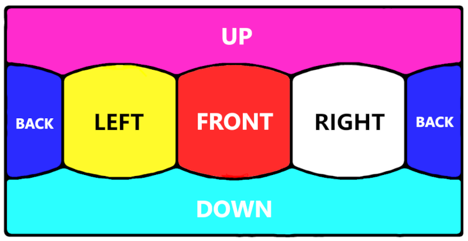
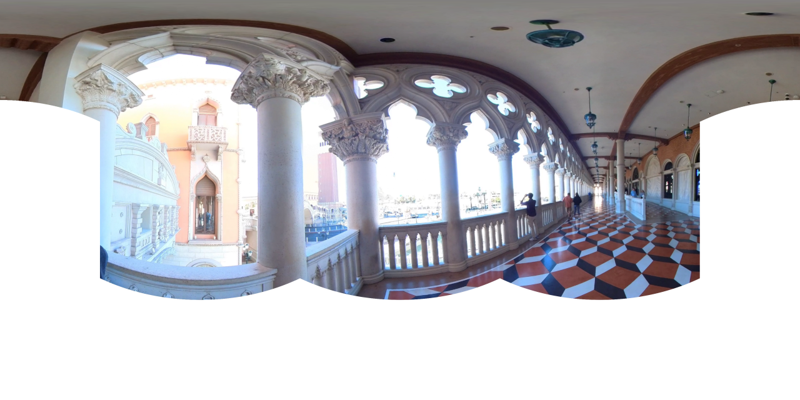
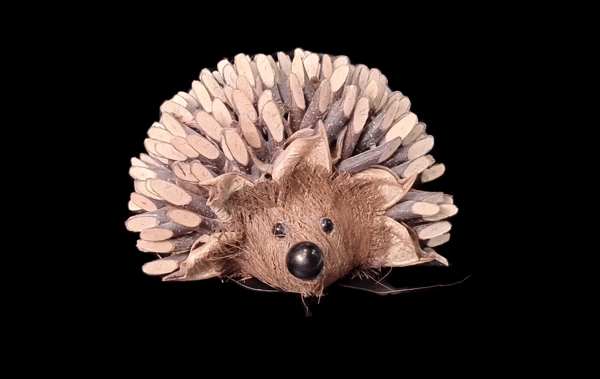
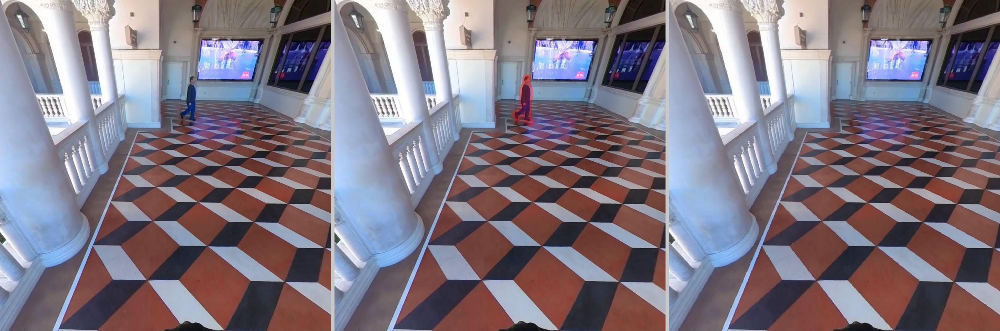

# Understanding the Configuration and Capabilities
This Guidance is built with a variety of open source tools that can be used for various use cases. Because of this, many options are contained in this Guidance. The following is a high-level overview of each option and its applicability.

## Deployment Configuration
Each deployment, CDK and Terraform, have their own deployment configuration which can be found at `deployment/cdk/config.json` and `deployment/terraform/config.json`. Use this configuration to customize your deployment based on your use-case.

### Current Deployment Configuration Supported
- **Account ID:** the AWS account ID to use for the deployment.
- **Region:** the AWS region to use for the deployment.
- **Construct Name Prefix:** the string that will be prepended to deployment resources in order to search more easily and group resources.
- **S3 Trigger Key:** the S3 bucket prefix (folder/directory) to use for the input job configuration. An SNS notification will be setup for this key.
- **Admin Email:** an email address to receive notifications of job status.
- **Maintain S3 Objects On Stack Deletion:** whether to delete or archive the S3 objects created with the resources upon stack deletion
- **Enable CodeBuild Container Build:** whether to enable building the container on the cloud. This will free up your computer from building the container which can take up to an hour to install.

### Current Job Schema Supported

    
Click to expand Job JSON Schema

    {
        "uuid": "010d5342-1876-4012-8868-c548b020b91c",
        "instanceType": "ml.g5.8xlarge",
        "useSpotInstance": "true",
        "logVerbosity": "info",
        "s3": {
            "bucketName": "3dgs-bucket-******",
            "inputPrefix": "media-input",
            "inputKey": "venetian_010d5342-1876-4012-8868-c548b020b91c.mp4",
            "outputPrefix": "workflow-output"
        },
        "imageProcessing": {
            "autoScaleDataset": false,
            "autoScaleDatasetMode": "RESIZE",
            "autoGroupImages": false,
            "autoGroupTargetName": ""
        },
        "videoProcessing": {
            "maxNumImages": "800",
            "videoStartTime": 0,
            "videoStopTime": null,
            "filterBlurryImages": true
        },
        "reconstruction": {
            "enable": true,
            "softwareName": "glomap",
            "posePriors": {
                "usePosePriorColmapModelFiles": false,
                "usePosePriorTransformJson": {
                    "enable": false,
                    "sourceCoordinateName": "arkit",
                    "poseIsWorldToCam": true
                }
            },
            "enableEnhancedFeatureExtraction": false,
            "matchingMethod": "sequential",
            "enableFlHeuristic": false,
            "flHeuristicValue": "1.1",
            "enableFlMetric": false,
            "flMetricValue": "24",
            "autoMatcher": false,
            "autoMapper": false
        },
        "training": {
            "enable": true,
            "maxSteps": "30000",
            "model": "splatfacto",
            "preserveSceneScale": false,
            "3dIsp": "bilagrid",
            "enableDepthLoss": false
        },
        "postProcessing": {
            "cropOutputBounds": true,
            "cropMode": "environment",
            "cleanSplat": false,
            "enableSpz": true,
            "enableSog": true,
            "enableUsdz": false,
            "enableVideoExport": true,
            "plyCoords": "rhyu",
            "spzCoords": "rhyu",
            "sogCoords": "rhyu",
            "usdzCoords": "rhyu"
        },
        "sphericalCamera": {
            "enable": true,
            "cubeFacesToRemove": [
                "down",
                "up"
            ]
        },
        "segmentation": {
            "backgroundRemoval": {
                "enable": false,
                "model": "sam2",
                "maskThreshold": "0.6"
            },
            "objectRemoval": {
                "enable": true,
                "action": "erase",
                "objects": "['human']"
            }
        }
    }

## Container Configuration
- **General**
    - **Workflow input:**
        - Video (.mov or .mp4)
        - Archive (.zip) of images (.png or .jpeg)
        - Archive (.zip) of pose priors and images (transforms.json, colmap model files)
        - Archive (.tar.gz) of previous dataset and checkpoint (for resume training)
    - **Workflow output:**
        - .ply, .sog, .spz, .usdz
        - .mp4 (trajectory rendering), .jpg (render thumbnail)
        - archive of project files (images, point cloud, metadata)
        - evaluation metrics (psnr, ssim, lpips)

- **UUID:** (string), a unique identifier used by backend system to record individual requests in DynamoDB
- **Instance type:** (string), the EC2 compute resource to use for the workflow. Currently, these instance types are tested and supported:
    - ml.g5.4xlarge (recommended for <500 4k images)
    - ml.g5.8xlarge (recommended for <500 4k images)
    - ml.g5.12xlarge (multi-gpu for faster training)
    - ml.g6e.4xlarge (for large datasets (e.g. >500 4k images or 3DGRT))
    - ml.g6e.8xlarge (for large datasets (e.g. >500 4k images or 3DGRT))
- **Use Spot instance:** (boolean), whether to use AWS Batch and spot instances for decrease in processing costs with an increase in queue times
- **Log verbosity:** (string), log levels include info, warning, and error
- **S3:**
    - **Bucket name:** (string), the name of the S3 bucket that was deployed by CDK/Terraform. This is an output from the deployment.
    - **Input prefix:** (string), the S3 prefix (initial directory minus the job prefix) for the input media
    - **Input key:** (string), the S3 key for the input media
    - **Output prefix:** (string), the S3 prefix (initial directory minus the job prefix) for the output files
- **Video processing:**
    - **Max number of images:** (integer), the maximum number of images to use when a video is given as input. If using a `.zip` file with images or pose priors, this parameter will be ignored.
    - **Filter blurry images:** (boolean), whether to remove blurry images from the dataset. If using a `.zip` file with pose priors, this parameter will be ignored.
    - **Video start time:** (integer), the time in seconds to start extracting frames from the video.
    - **Video stop time:** (integer), the time in seconds to stop extracting frames from the video.
- **Image processing:**
    - **Autoscale dataset:** (boolean), when enabled, automatically resizes or drops images so the dataset fits within the GPU's VRAM budget. Images are capped at 4K resolution (3840px long edge) regardless of VRAM. Two modes are available:
        - **RESIZE** (default): downscales all images to a resolution that fits in VRAM while maintaining aspect ratio (minimum 1080p)
        - **DROPOUT**: uniformly drops images to reduce count while preserving the original resolution
    - **Autogroup images:** (boolean), when enabled, filters images by a target filename prefix (e.g. "dji") to select only matching images from a mixed dataset. Useful when a folder contains images from multiple cameras or capture sessions.
        - **Autogroup target name:** (string), the filename prefix to filter by (e.g. "dji" keeps only files starting with "DJI")
- **Reconstruction (SfM):**
    - **Enable:** (boolean), whether to enable SfM or not. Future plans will enable input of SfM output
    - **Software name:** (string), colmap, glomap, or hloc. Software to use for the triangulation of the mapper
    - **Auto mapper:** (boolean), when enabled, overrides the **Software name** at runtime based on the actual image count after pre-processing:
        - < 600 images → **glomap** (global mapper — fast for small sets)
        - 600–5000 images → **colmap** (incremental mapper — robust for medium sets)
        - \> 5000 images → **hloc** (hierarchical mapper — scales to large sets)
    - **Enable enhanced feature extraction:** (boolean), whether to enable enhanced feature extraction which uses `estimate_affine_shape` to enhance the feature matching
    - **Matching method:**
        - sequential (best for videos or images that share overlapping features)
        - spatial (best to use for pose priors or GPS to take spatial orientation into account)
        - vocab (best for large datasets that are not sequentially bound)
        - exhaustive (only use this method if dataset struggles to converge with other methods)
    - **Auto matcher:** (boolean), when enabled, overrides the **Matching method** at runtime by analyzing image overlap using ORB feature matching on sampled pairs. The analysis uses multi-stride sampling (stride 1, 2, 3) with median overlap and a "sequential signal" metric (fraction of consecutive pairs with meaningful overlap) to tolerate scattered non-overlapping frames. Decision logic (evaluated in order, first match wins):
            1. GPS EXIF coordinates detected or pose priors enabled → **spatial** — leverages known camera positions for efficient neighbor lookup
            2. ≥70% of consecutive pairs overlap AND median overlap ≥ 0.20 → **sequential** — images are in capture order with strong frame-to-frame continuity (e.g. video frames, walk-around captures)
            3. \> 1000 images with median overlap ≥ 0.10 → **vocab** — exhaustive matching on large datasets is O(n²) which becomes prohibitively slow (e.g. 4000 images = ~16M pairs). Vocab tree matching uses a visual vocabulary to find likely matches in roughly O(n·log n), dramatically reducing matching time while still finding cross-scene matches that sequential would miss. This is the typical result for large drone datasets where images aren't strictly sequential after pre-processing (autogroup, autoscale)
            4. Median overlap < 0.10 → **exhaustive** — low overlap means the scene has few shared features between neighbors, so brute-force comparison of all pairs gives the best chance of finding matches
            5. \> 1000 images (any overlap) → **vocab** — catches large datasets that passed the sequential signal check but didn't meet the median threshold
            6. Fallback → **exhaustive** — most reliable method for small-to-medium unordered datasets where the O(n²) cost is acceptable
    - **Enable focal length heuristic:** (boolean), whether to enable focal length estimate to help normalize the scene scale if focal length is unknown. This uses the formula `focal_length = fl_heur_val*max(x_res, y_res)`
    - **Focal length heuristic value:** (string), coefficient used in focal length heuristic (default: 1.2).
    - **Enable focal length metric:** (boolean), whether to use a known metric focal length in pixels directly instead of estimating it. Takes priority over the heuristic if both are enabled.
    - **Focal length metric value:** (string), the known focal length in pixels to use when `enableFlMetric` is true (default: 24). in order to speed up reconstruction, camera poses associated with the images can be used as input. In particular, this feature accepts a `.zip` archive folder that has the same schema as [NerfCapture](https://github.com/jc211/NeRFCapture/tree/main){:target="_blank"} or can be a `.zip` archive folder that contains images and sparse directories with [Colmap model text files](https://colmap.github.io/faq.html#reconstruct-sparse-dense-model-from-known-camera-poses){:target="_blank"}.

        > *Note: The primary use case for `enableDepthLoss` is when providing a LiDAR-derived point cloud via `usePosePriorColmapModelFiles`. The LiDAR point cloud is projected as sparse depth supervision during training, anchoring Gaussians to accurate metric geometry. It also works with standard colmap reconstructions as a weaker depth signal. Depth image files are not required.*

        > ***Note:** All image files must be sequentially named and padded (e.g. 001.png, 002.png, etc.)*
    - **Pose Priors**
        - **Use pose prior Colmap model files:** see [Colmap model text files](https://colmap.github.io/faq.html#reconstruct-sparse-dense-model-from-known-camera-poses){:target="_blank"}
            - The file schema for providing the already created Colmap model files looks like this
                

                
<strong>Archive structure (.zip)</strong>

                <pre style="background-color: #F6F6F6;">
                <code>
                archive.zip
                ├── images/
                    └── *.{png,jpg,jpeg}
                └── sparse/
                    ├── 0/
                        └── cameras.txt (camera intrinsics)
                        └── images.txt (camera extrinsics/poses)
                        └── points3D.txt (empty)
                </code>
                </pre>
                

        - **Use pose prior transform JSON:** see [NerfCapture](https://github.com/jc211/NeRFCapture/tree/main){:target="_blank"}
            > *Ensure the `.zip` contains both the `transforms.json` file and an `/images` directory with sequentially named RGB images.*
            - **Enable:** (boolean), whether to enable using `transforms.json` file for pose priors.
            - **Source coordinate name:** ("arkit" or "arcore" or "opengl" or "opencv" or "ros"), the source coordinates used with pose priors
            - **Pose is world-to-camera:** (boolean), whether the source coordinates for pose priors are in world-to-camera (True) or camera-to-world (False)
            - The schema for `transforms.json` to input looks like this in case you would perform an alternate method to extract the image and poses.
                > ***Note:** Depth images do not need to be present in the `.zip` file, but the "depth_path" still needs to be filled so the extension is known. For example if image is `images/3.png`, then `depth_path=images/3.depth.png` and `file_path=images/3`. `timestamp` and `depth_images` are not currently used in the pipeline.*
                

                
<strong>Sample <code>transforms.json</code> contents</strong>

                <pre style="background-color: #F6F6F6;">
                <code>
                {
                    "frames": [
                        {
                            "fl_y": 1363.47,
                            "w": 1920,
                            "fl_x": 1363.47,
                            "cy": 728.95135,
                            "timestamp": 309075.09929275,
                            "depth_path": "images/3.depth.png",
                            "transform_matrix": [
                                [
                                    -0.98750305,
                                    0.08610178,
                                    -0.13199921,
                                    0.9487833
                                ],
                                [
                                    0.024557188,
                                    0.91140217,
                                    0.41078326,
                                    -0.5495963
                                ],
                                [
                                    0.1556736,
                                    0.40240824,
                                    -0.9021269,
                                    -0.4476293
                                ],
                                [
                                    0,
                                    0,
                                    0,
                                    1
                                ]
                            ],
                            "file_path": "images/3",
                            "cx": 956.5136,
                            "h": 1440
                        },
                        ...
                    ]
                }
                </code>
                </pre>
                

            - Parameter definitions
                

                
<strong>Parameter defintions</strong>

                <pre style="background-color: #F6F6F6;">
                <code>
                "cx": camera sensor center on x-axis in pixels
                "cy": camera sensor center on y-axis in pixels
                "fl_x":  focal length on x-axis in pixels
                "fl_y": focal length on y-axis in pixels
                "w": camera resolution width in pixels
                "h": camera resolution height in pixels
                "file_path": this will look like this: "images/13" if image filename is images/13.png
                "depth_path": this will look like this: "images/13.depth.png" if image filename is images/13.depth.png (even if you dont have depth images, fill this in with correct extension)
                "transform_matrix": 4x4 pose matrix
                "timestamp": seconds (can be absolute or use epoch)
                </code>
                </pre>
                

            - Archive structure (.zip)
                

                
<strong>Archive structure (.zip)</strong>

                <pre style="background-color: #F6F6F6;">
                <code>
                archive.zip
                ├── transforms.json
                └── images/
                    └── *.{png,jpg,jpeg}  # Image files, depth images need "depth" in file name
                </code>
                </pre>
                

- **Training:**
    - **Enable:** (boolean), whether to enable 3DGS training or not. Future plans will enable user to only perform SfM
    - **Maximum steps:** (integer), The maximum training steps to use while training the splat
    - **Splat model:** (string), splatfacto, splatfacto-mcmc, splatfacto-big, splatfacto-w-light, 3dgrt, 3dgut, nerfacto, The 3DGS model to use for training
        - Pointers:
            - **splatfacto:** a great, generalized model that is perfect to start with if you are unsure what model to choose
            - **splatfacto-big:** high quality model that should be used to output feature-rich scenes and objects. This will yield a larger .ply file.
            - **splatfacto-w-light:** if wanting to achieve superior quality, while still pruning unwanted gaussians, use this one. This model will take the longest time, but the output file size will be much less, while still upholding quality.
            - **splatfacto-mcmc:** the current SotA that balances small training time with high quality output
            - **nerfacto:** used for testing and comparisons between NeRF and GS. The output will be a NeRF. Beware, this model will need more images than GS in order to maintain higher quality.
            - **3dgut:** used for enabling Distorted Cameras and Secondary Rays in Gaussian Splatting. Great for fisheye camera input.
            - **3dgrt:** used for 3D Gaussian Ray Tracing and Fast Tracing of Particle Scenes. Great for highly detailed scenes at the cost of processing power and time
    - **Preserve scene scale:** (boolean), whether to preserve the reconstruction scale during gaussian splat training
    - **3D image signal processing:** (string), technique to use for scene signal processing. Current options are bilagrid (bilateral grid), ppisp (physically plausible image signal processing)
    - **Enable depth loss:** (boolean), whether to enable sparse depth supervision during training. The primary use case is when a LiDAR-derived point cloud is provided as pose prior input (via `usePosePriorColmapModelFiles`), giving the trainer accurate metric depth to anchor the Gaussians. It also works with standard colmap point cloud projections as a weaker depth signal. When enabled, overrides the model choice and uses gsplat's `simple_trainer` with depth loss. Requires a colmap reconstruction. Improves geometric accuracy especially for scenes with strong depth cues. Video export and nerfstudio metrics are not available when this is enabled.

- **Post Processing:**
    - **Crop output bounds:** (boolean), whether to crop gaussians that are outliers.
    - **Crop mode:** (string), mode to use for cropping the gaussian scene. Options include environment and rigid_object.
    - **Clean splat:** (boolean), whether to clean gaussians that are noisy.
    - **Enable spz output:** (boolean), whether to output a compressed .spz file.
    - **Enable sog output:** (boolean), whether to output a compressed .sog file.
    - **Enable usdz output:** (boolean), whether to output a compressed .usdz file.
    - **Enable video export:** (boolean), whether to render and export a trajectory flythrough video (.mp4) and thumbnail (.png) of the trained splat.
    - **Ply Coordinates:** (string), the coordinate system to transform the .ply to. Options include rhyu (right-hand, y-up, playcanvas), lhyu (left-hand, y-up, babylon.js), rhzu (right-hand, z-up, blender), and lhzu (left-hand, z-up, unreal)
    - **Spz Coordinates:** (string), the coordinate system to transform the .spz to. Options include rhyu (right-hand, y-up, playcanvas), lhyu (left-hand, y-up, babylon.js), rhzu (right-hand, z-up, blender), and lhzu (left-hand, z-up, unreal)
    - **Sog Coordinates:** (string), the coordinate system to transform the .sog to. Options include rhyu (right-hand, y-up, playcanvas), lhyu (left-hand, y-up, babylon.js), rhzu (right-hand, z-up, blender), and lhzu (left-hand, z-up, unreal)
    - **Usdz Coordinates:** (string), the coordinate system to transform the .usdz to. Options include rhyu (right-hand, y-up, playcanvas), lhyu (left-hand, y-up, babylon.js), rhzu (right-hand, z-up, blender), and lhzu (left-hand, z-up, unreal)

- **Spherical camera:**
    - **Enable:** (boolean), whether to enable 360 camera support or not
    - **Cube faces to remove:** "['back', 'down', 'front', 'left', 'right', 'up']", a list of cube faces to remove from the spherical image. This is great for cropping out people or objects from the 360 image. 

    > *Note: The above configurations were tested with an Insta360 ONE X2, exporting frame(s) in equirectangular format, 9:16 ratio, 5.7k resolution, and 30 frames per second. The captures were taken with the camera display aimed toward the person capturing the frame(s).*

    

     
     
    <i>Figure 1: Equirectangular cube map views from a spherical camera</i>
    

    

     
    

    

     
     
    <i>Figure 2: Equirectangular cube map views from a spherical cameraExample: Enable Spherical Camera = true, Cube Faces to Remove = "['back', 'down']"</i>
    

     
    

- **Segmentation:**
    - **Background removal:**
        - **Enable:** (boolean), whether to remove the background when input an object (not scene) or not
        - **Background removal model:** "u2net" or "sam2" the background removal model to use
        > *Note: The sam2 model can only be used on video at this time*
        - **SAM2 mask threshold:** (string), threshold to use for mask. If object doesn't have large contrast from the background, use lower number like 0.38.

    

     
     
    <i>Figure 3: Background removal using SAM2</i>
     

- **Object removal:**
    - **Enable:** (boolean), whether to remove objects from images
    - **Action:** (string), whether to erase or remove the objects.
    - **Objects:** (string list), the list of objects to remove. Currently only human is supported.

    

     
     
    <i>Figure 4: Erasing humans from the dataset</i>